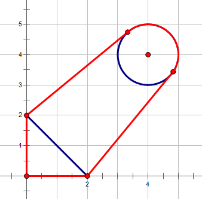

# Building Fence

## Description

Long long ago, there is a famous farmer named John. He owns a big farm and many cows. There are two kinds of cows on his farm, one is Friesian, and another one is Ayrshire. Each cow has its own territory. In detail, the territory of Friesian is a circle, and of Ayrshire is a triangle. It is obvious that each cow doesn't want their territory violated by others, so the territories won't intersect.

Since the winter is falling, FJ has to build a fence to protect all his cows from hungry wolves, making the territory of cows in the fence. Due to the financial crisis, FJ is currently lack of money, he wants the total length of the fence minimized. So he comes to you, the greatest programmer ever for help. Please note that the part of fence don't have to be a straight line, it can be a curve if necessary.

## Input

The input contains several test cases, terminated by EOF. The number of test cases does not exceed 20.

Each test case begins with two integers $N$ and $M$($0 \leq N, M \leq 20$, $N + M > 0$), which denotes the number of the Friesian and Ayrshire respectively. Then follows $N + M$ lines, each line representing the territory of the cow. Each of the first $N$ lines contains three integers $X_i$, $Y_i$, $R_i$($1 \leq R_i \leq 500$), denotes the coordinates of the circle's centre and radius. Then each of the remaining $M$ lines contains six integers $X1_i$, $Y1_i$, $X2_i$, $Y2_i$, $X3_i$, $Y3_i$, denotes the coordinates of the triangle vertices. The absolute value of the coordinates won't exceed $10000$.

## Output

For each test case, print a single line containing the minimal fence length. Your output should have an absolute or relative error of at most $1e-3$.

## Sample Input
	1 1
	4 4 1
	0 0 0 2 2 0

## Sample Output
	15.66667

## Hint
Please see the sample picture for more details, the fence is highlighted with red.

